# HFT SOC Lab — Final Project Playbook

| | |
|---|---|
| **Name** | VISHWAS H N |
| **SRN** | PES1UG23CS701 |
| **Section** | L |

| | |
|---|---|
| **Name** | SHESHAGIRI S |
| **SRN** | PES1UG24CS832 |
| **Section** | H |

> **Project**: Automated SOC Pipeline for High-Frequency Trading (HFT) Security  
> **Stack**: MISP · Wazuh · Shuffle · Node.js · React · ngrok · VirtualBox  
> **VM IP**: `192.168.56.105` (Ubuntu, NAT + Host-Only adapter)

---

## 1. System Architecture

```
┌─────────────────────────────────────────────────────────────────────┐
│                        UBUNTU VM (192.168.56.105)                   │
│                                                                     │
│  ┌──────────────────┐  ┌──────────────────┐  ┌──────────────────┐  │
│  │  MISP :8081      │  │  Wazuh :443      │  │  Shuffle :3001   │  │
│  │  4 Threat Events │  │  SIEM + Rules    │  │  SOAR Workflows  │  │
│  │  12 Malicious IPs│  │  10 Custom Rules │  │  Webhook Trigger │  │
│  └────────┬─────────┘  └────────┬─────────┘  └────────┬─────────┘  │
│           │ sync every 5min     │ reads agent logs    │ calls ngrok │
└───────────┼─────────────────────┼────────────────────-┼────────────┘
            │                     │                      │
            ▼                     │                      │
┌───────────────────────────────────────────────────────────────────┐
│                    WINDOWS HOST (Your Laptop)                     │
│                                                                   │
│  ┌─────────────────────────────────┐   ┌──────────────────────┐  │
│  │  Node.js Backend :5000          │   │  React Frontend :5173│  │
│  │  • MISP sync every 5 min        │   │  • 3-column dashboard│  │
│  │  • Live simulation engine       │   │  • Live event feed   │  │
│  │  • Auto-block MISP IPs          │   │  • SOAR panel        │  │
│  │  • CEF logging → app.log        │   │  • Event log table   │  │
│  │  • ngrok tunnel (public URL)     │   └──────────────────────┘  │
│  └─────────────┬───────────────────┘                             │
│                │                                                   │
│  ┌─────────────▼──────────────────────────────────┐              │
│  │  Wazuh Windows Agent (ID: 003)                 │              │
│  │  Monitors: auth.log, network.log, app.log      │              │
│  │  Ships logs → Wazuh Manager on VM              │              │
│  └────────────────────────────────────────────────┘              │
│                                                                   │
│  ┌─────────────────────────────────────────────────────────────┐ │
│  │  Log Files (soc/backend/logs/)                              │ │
│  │  auth.log     — SSH login events (syslog format)           │ │
│  │  network.log  — HTTP traffic (hft-network syslog format)   │ │
│  │  app.log      — CEF events: MISP detections, blocks        │ │
│  │  blocked_ips.txt — Persistent IP blocklist                 │ │
│  └─────────────────────────────────────────────────────────────┘ │
└───────────────────────────────────────────────────────────────────┘
```

---

## 2. Component Roles

| Component | Where | Role |
|---|---|---|
| **MISP** | VM :8081 | Threat Intelligence — stores 4 events with 12 malicious IPs |
| **Wazuh** | VM :443 | SIEM — reads logs, applies 10 custom rules, generates alerts |
| **Shuffle** | VM :3001 | SOAR — automates block-IP action via ngrok webhook |
| **Node.js** | Windows :5000 | Backend — syncs MISP, runs simulation, writes CEF logs |
| **React** | Windows :5173 | Dashboard — 3-column real-time UI |
| **ngrok** | Windows | Tunnel — exposes backend API to VM for Shuffle webhooks |
| **Wazuh Agent** | Windows | Log shipper — monitors 3 log files, sends to Wazuh manager |

---

## 3. MISP Events & IP Inventory

| Event | Threat Campaign | Key IPs |
|---|---|---|
| **Event 1** | Malicious IPs targeting financial platforms | 45.33.32.156 (Shodan), 185.220.101.34 (Tor), 203.0.113.99 (C2) |
| **Event 2** | SSH Brute Force Campaign targeting HFT Firms | 188.166.26.195, 45.142.212.100, 91.240.118.168 |
| **Event 3** | APT Reconnaissance against Financial Platforms | 222.186.180.130 (APT/SWIFT), 103.99.115.220 (Lazarus), 193.32.162.157 |
| **Event 4** | Ransomware + DDoS Combined Attack on HFT | 185.217.131.88 (Ryuk C2), 185.234.218.126 (Mirai), 5.188.206.25, + 2 shared |

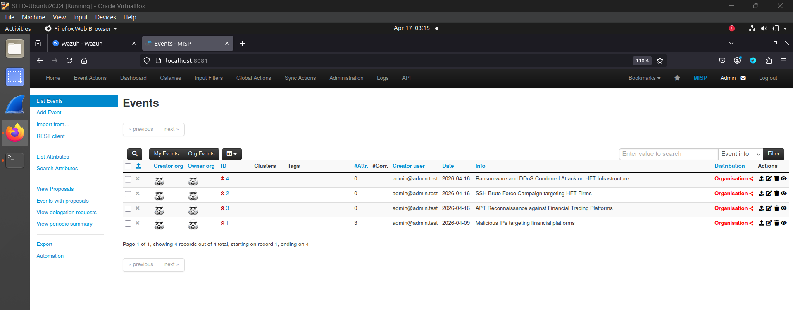

**Cross-event correlations (MISP Graph):**
- `203.0.113.99` — Events 1 ↔ 4 (C2 server reused across campaigns)
- `188.166.26.195` — Events 2 ↔ 3 (same brute-force bot in APT recon)
- `193.32.162.157` — Events 3 ↔ 4 (exfil endpoint reused post-encryption)

> This models real **APT infrastructure reuse** — threat actors share IPs across campaigns.

**Correlation Graph — Event 1 (Malicious IPs) ↔ Event 4 (Ransomware):**  
IP `203.0.113.99` (C2 server) appears in both campaigns, MISP auto-links them.


**Correlation Graph — Event 4 (Ransomware) — Multi-event linkage:**  
IPs `203.0.113.99` and `193.32.162.157` connect Events 1, 3, and 4 — same threat actor infrastructure.

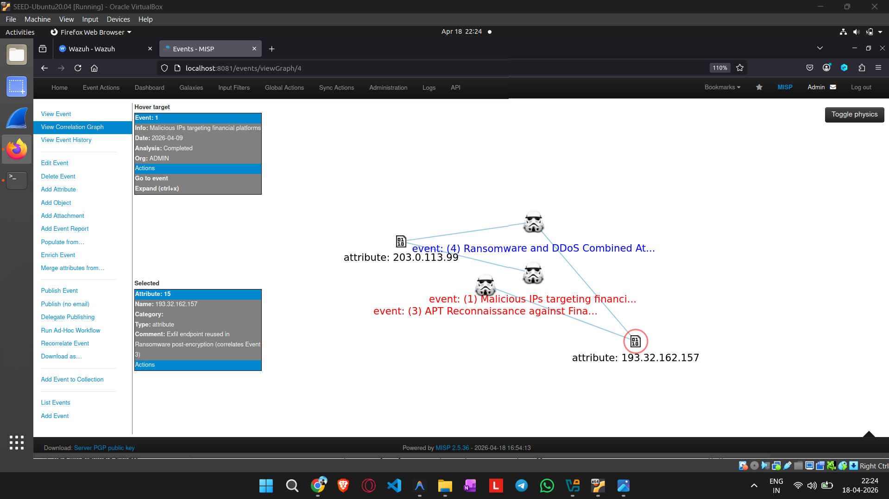

**Correlation Graph — Event 3 (APT Recon) — SSH + APT crossover:**  
IPs `188.166.26.195` and `193.32.162.157` link Events 2, 3, and 4 — proving reconnaissance feeds into ransomware deployment.

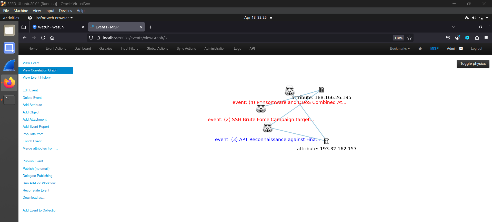

**Correlation Graph — Event 2 (SSH Brute Force) — Pivot to APT:**  
IP `188.166.26.195` (brute-force bot) also appears in APT reconnaissance (Event 3), showing campaign progression.

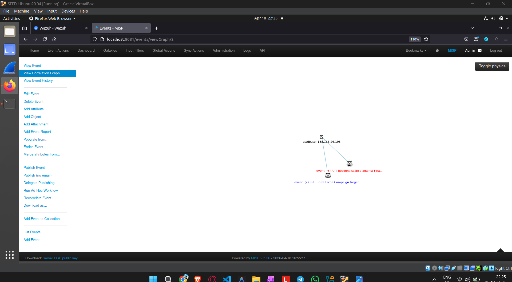

---

## 4. Wazuh Rules Reference

| Rule ID | Level | Source Log | Trigger Condition |
|---|---|---|---|
| **100001** | 5 | auth.log | Any single SSH login failure |
| **100002** | 10 | auth.log | 5+ SSH failures from same IP in 60 seconds |
| **100003** | 12 | app.log | `Algorithm_Modified` + `Unauthorized` in CEF event |
| **100010** | 3 | network.log | Any `GET /api/public/market-data` request |
| **100004** | 14 | network.log | 40+ market-data requests from same IP in 30 seconds |
| **100021** | 15 | network.log | srcip matches any of the 12 MISP IPs (from rule 100010) |
| **100030** | 12 | app.log | `MISP_IOC_Detected` in CEF event |
| **100031** | 15 | app.log | `MISP_IOC_Detected` AND `severity=CRITICAL` |
| **100032** | 13 | app.log | `IP_Blocked` in CEF event (first-time block) |
| **100033** | 10 | app.log | `IP_Block_Repeated` in CEF event (repeat attempt) |

---

## 5. Log Flow: One MISP IP Through the System

```
Simulation picks 185.217.131.88 (Ryuk ransomware C2 — MISP Event 4)
│
├─► network.log: "GET /api/trade/execute HTTP/1.1 from 185.217.131.88"
│     └─► Rule 100010 (Level 3)  — Market Data Tracking
│         └─► Rule 100021 (Level 15) — MISP IP in network traffic
│
└─► app.log: "MISP_IOC_Detected … ip=185.217.131.88 severity=HIGH"
      └─► Rule 100030 (Level 12) — MISP Threat Intel Detected

    SOAR auto-blocks → app.log: "IP_Blocked … NEW_BLOCK ip=185.217.131.88"
      └─► Rule 100032 (Level 13) — SOAR Auto-Block

    Next tick — same IP tries again → app.log: "IP_Block_Repeated … DENIED_REPEAT"
      └─► Rule 100033 (Level 10) — Blocked IP Repeat Attempt

    blocked_ips.txt: "185.217.131.88 | 2026-04-17T09:52:48Z | SOAR-AutoResponse | Ryuk ransomware C2"
```

**Live app.log + Backend terminal showing CEF events being written and simulation output:**

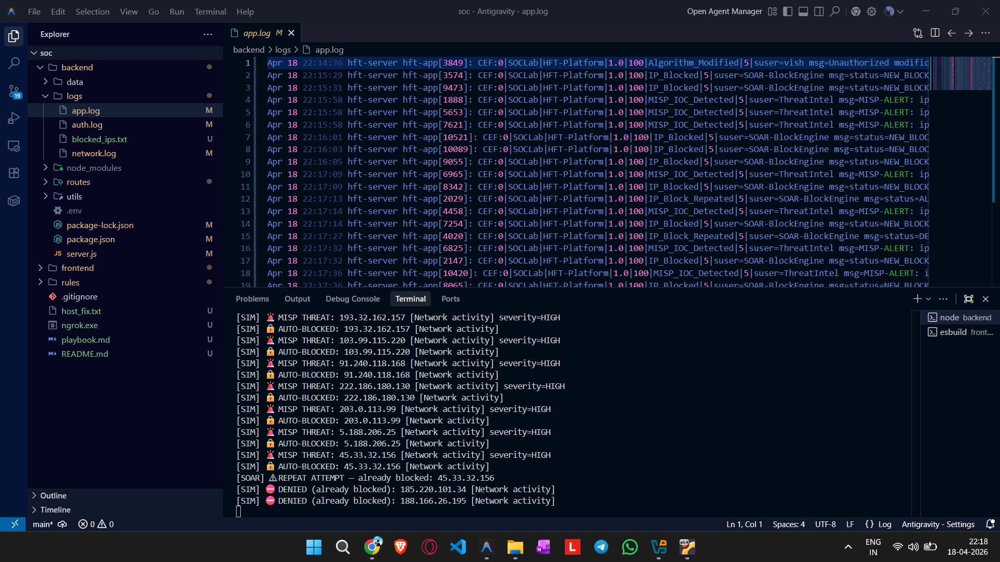

---

## 6. File Structure

```
soc/
├── backend/
│   ├── server.js              Entry point: Express, ngrok, dotenv, MISP sync
│   ├── .env                   MISP_URL + MISP_KEY (not in git)
│   ├── routes/
│   │   ├── actions.js         Simulation, block-IP, SOAR, MISP routes
│   │   └── auth.js            Login/register event generation
│   └── logs/
│       ├── auth.log           SSH events → Wazuh rule 100001/100002
│       ├── network.log        HTTP traffic → Wazuh rule 100010/100004/100021
│       ├── app.log            CEF events → Wazuh rule 100030-100033
│       └── blocked_ips.txt    Persistent blocklist (survives restarts)
│
├── frontend/
│   └── src/
│       ├── App.jsx            3-column dashboard (sidebar, console, right-panel)
│       └── index.css          All styles (grid layout, panels, sim feed)
│
├── rules/                     ← Copy to VM before deploying
│   ├── local_rules.xml        All 10 Wazuh rules (with comments)
│   ├── local_decoder.xml      hft_app_decoder + hft_network_decoder
│   └── sync_misp.sh           Auto-sync script (run on VM)
│
├── ngrok.exe                  Tunnel binary (Windows)
└── playbook.md                This file
```

---

## 7. Startup Procedure

### Step 1 — Start Ubuntu VM
```
Open VirtualBox → Start "SEED-Ubuntu20.04"
Wait for login prompt. VM IP: 192.168.56.105
```

### Step 2 — Verify VM Services
```bash
ssh seed@192.168.56.105

# Check all containers running
docker ps --format "table {{.Names}}\t{{.Status}}"

# Should show: misp-docker-misp-core-1, single-node_wazuh.manager_1,
#              single-node_wazuh.dashboard_1, shuffle-backend, etc.
```

### Step 3 — Start Backend (Windows)
```powershell
cd c:\Users\User\Downloads\soc\backend
npm start

# Wait for:
# [MISP] ✓ Synced 12 IPs from MISP (MISP-only mode)
# [ngrok] ✓ Public URL: https://xxxx.ngrok-free.dev
```

### Step 4 — Start Frontend (Windows, new terminal)
```powershell
cd c:\Users\User\Downloads\soc\frontend
npm run dev

# Open: http://localhost:5173
# Login: vish / 123 (or any credentials)
```

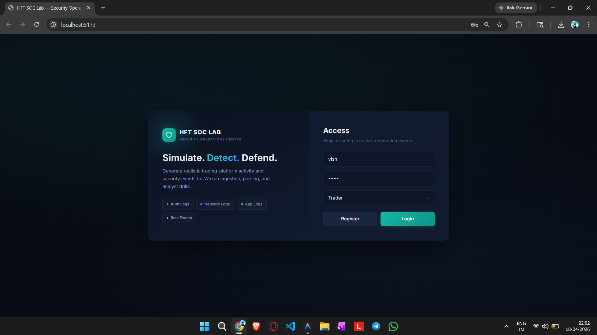

### Step 5 — Verify Wazuh Agent
```bash
# On VM
docker exec single-node_wazuh.manager_1 /var/ossec/bin/agent_control -l
# Should show: ID: 003, Name: LAPTOP-C2QFGGL7, Active
```

---

## 8. Demo Script (Step-by-Step, ~15 minutes)

### Opening (2 min)
> "This is a production-grade SOC lab for an HFT firm. Everything here — MISP, Wazuh, Shuffle — are the same tools used in real Security Operations Centres worldwide."

Show the dashboard. Explain the 3 columns:
- **Left**: Control panels for generating security events
- **Centre**: Live event console + event log
- **Right**: Live simulation engine + SOAR response

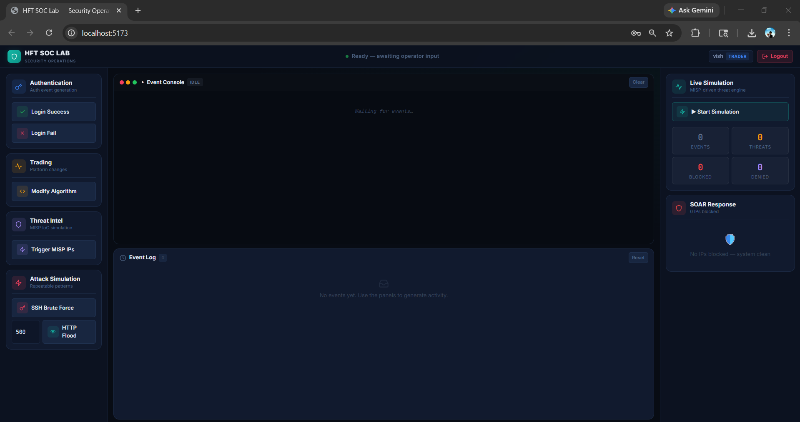

---

### Step 1 — MISP Threat Intelligence (3 min)
> "MISP is where our threat intelligence lives. We have 4 events representing real attack campaigns."

1. Open `http://192.168.56.105:8081` → Event List
2. Show all 4 events — point out threat levels, categories
3. Click **Event 4** → **View Correlation Graph**
4. *"Notice how Events 1, 3, and 4 are connected — same IP addresses used across campaigns. This is infrastructure reuse — a classic APT signature. MISP auto-detects this."*


---

### Step 2 — Backend MISP Sync (1 min)
> "The backend auto-pulls these 12 IPs from MISP every 5 minutes."

Show backend terminal: `[MISP] ✓ Synced 12 IPs from MISP`

Or live test:
```powershell
curl http://localhost:5000/api/actions/misp-status
```

---

### Step 3 — Start Live Simulation (3 min)
> "The simulation generates realistic HFT network traffic. 60% will be MISP-tracked malicious IPs, 40% normal traffic."

1. Click **▶ Start Simulation** (right panel)
2. Point to the live feed:
   - 🟡 Yellow = Threat Detected (first seen)
   - 🔴 Red = Auto-Blocked (SOAR response)
   - 🟣 Purple = Denied (already blocked, trying again)
3. After ~60 seconds all 12 IPs are blocked. The SOAR panel fills up.

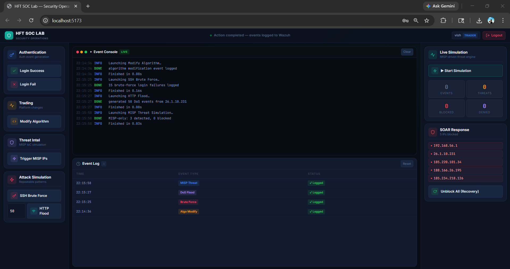

---

### Step 4 — Wazuh Alerts (2 min)
> "Every detection generates a CEF-format alert. Wazuh reads these and fires our custom rules."

1. Open `https://192.168.56.105` → Security Events
2. Filter: `rule.groups: misp`
3. Show Rules 100030, 100032, 100033 firing
4. Show the raw `app.log` on Windows for the CEF format

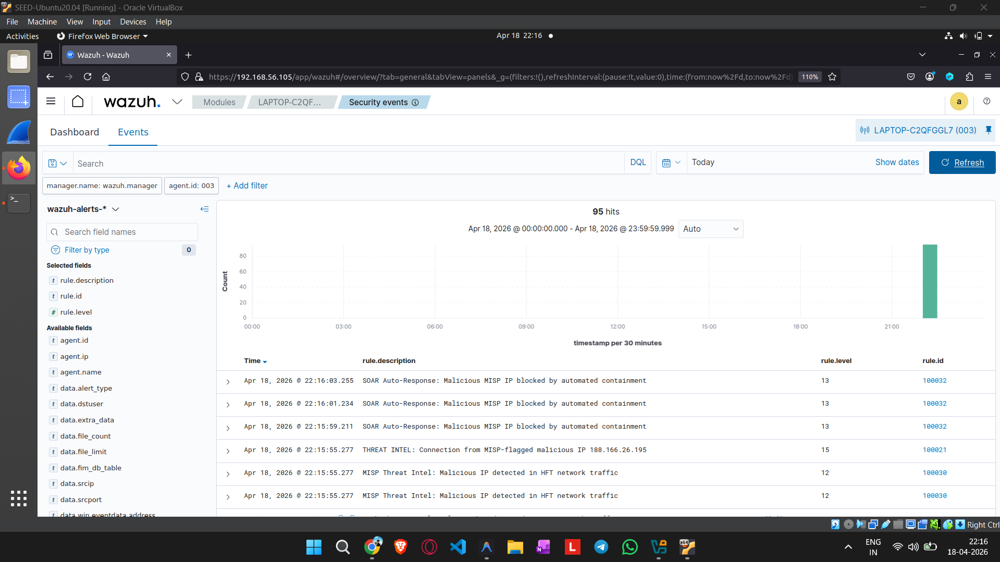

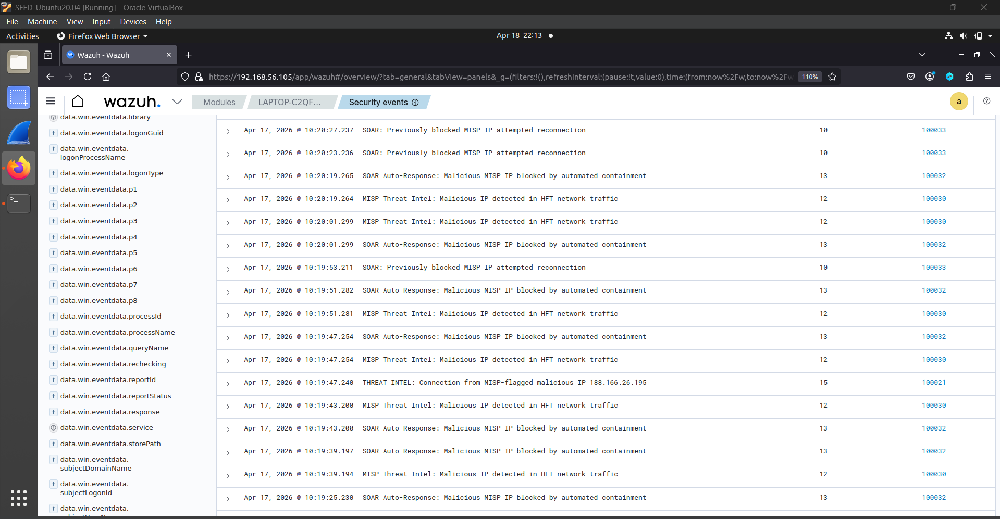

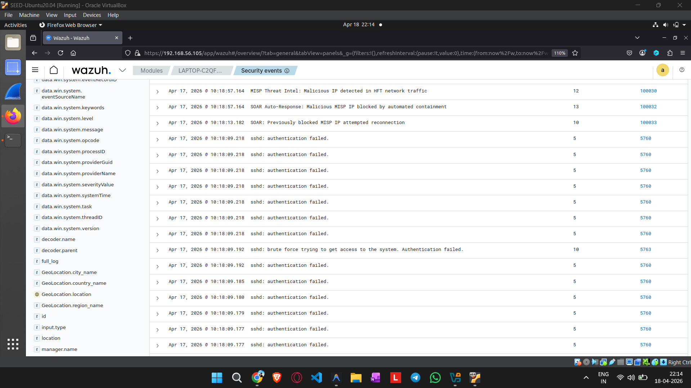

---

### Step 5 — Attack Simulation (2 min)

**Unauthorized Algorithm Modification:**
1. Login as `vish` (Trader role)
2. Click **Modify Algorithm**
3. Wazuh: Rule 100003 fires (Level 12, Unauthorized modification)

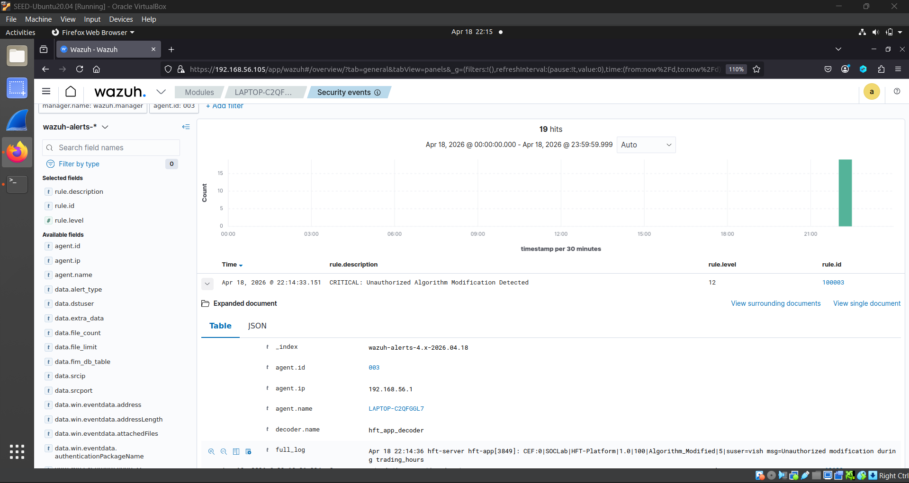

**SSH Brute Force:**
1. Click **SSH Brute Force** → 15 failures logged
2. Wazuh: Rule 100002 fires (Level 10, Brute Force alert)

**HTTP Flood / DoS:**
1. Set count to 50 → click **HTTP Flood**
2. Wazuh: Rule 100004 fires (Level 14, DoS alert)

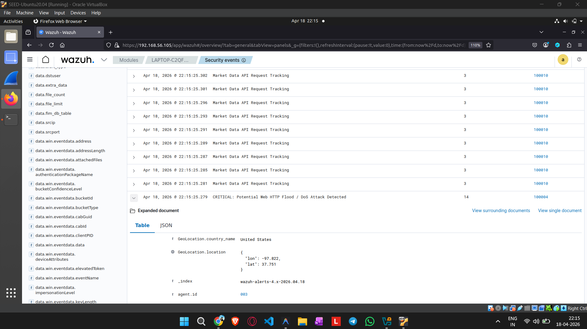

---

### Step 6 — SOAR Recovery (1 min)
> "After investigation, an analyst clears the blocklist to restore access."

1. Click **Unblock All (Recovery)**
2. SOAR panel clears
3. Restart simulation → IPs start getting blocked fresh again

---

### Step 7 — Shuffle SOAR Workflow (if ngrok running, 1 min)
> "Shuffle is our SOAR engine — it can block IPs externally, without going through our dashboard."

1. Show Shuffle at `http://192.168.56.105:3001`
2. Show the workflow — Webhook → HTTP node

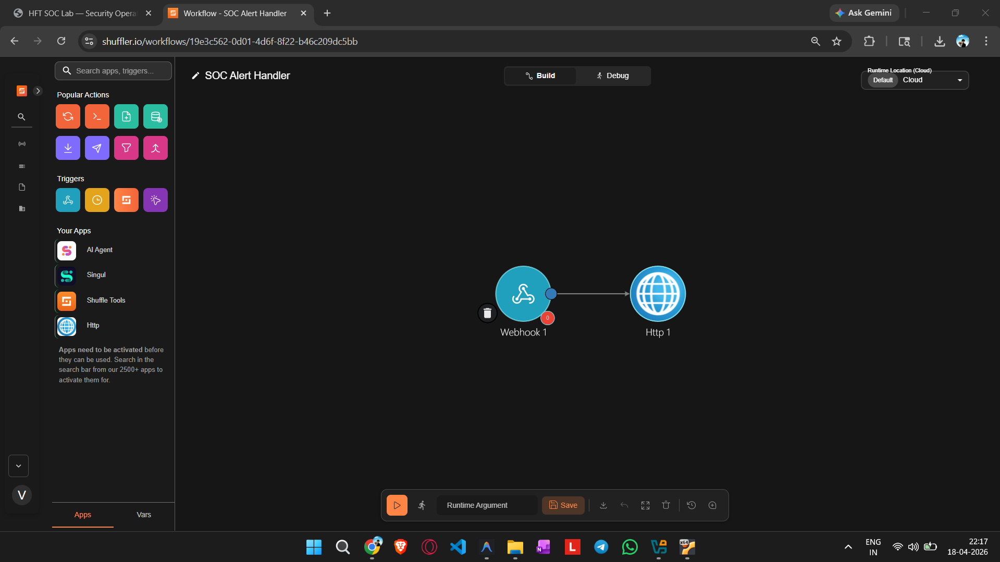

3. Show the HTTP node configuration pointing at the ngrok URL


4. Show the Webhook running state (active, listening)

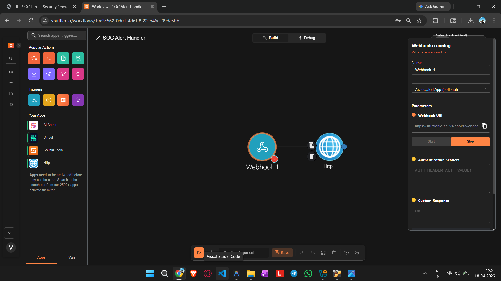

5. Show a completed execution — Wazuh alert triggered the workflow

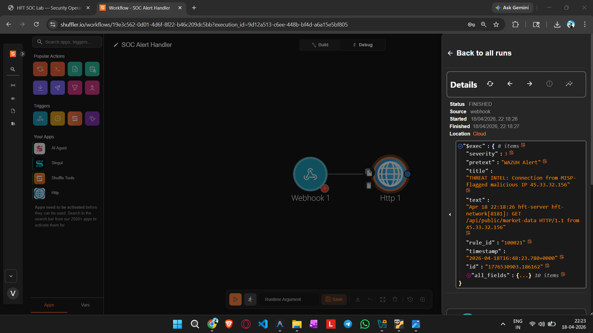

6. Show the HTTP response — block-IP was called and returned 200

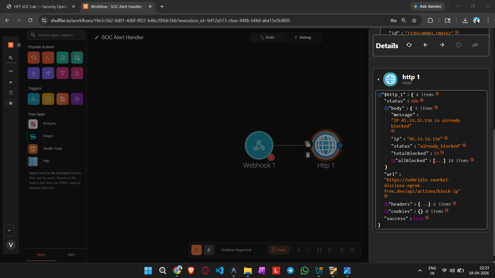

---

## 9. Maintenance Commands

### Update MISP Rules in Wazuh (after adding new IPs to MISP)
```bash
# On Ubuntu VM
bash ~/sync_misp.sh
```

### Check current Wazuh rules
```bash
docker exec single-node_wazuh.manager_1 grep "rule id" /var/ossec/etc/rules/local_rules.xml
```

### Watch live Wazuh alerts
```bash
docker exec single-node_wazuh.manager_1 tail -f /var/ossec/logs/alerts/alerts.log \
  | grep -E "100030|100031|100032|100033|100002|100004|MISP|SOAR|Brute"
```

### Test a rule manually (without agents)
```bash
echo "Apr 17 09:44:00 hft-server hft-app[1234]: CEF:0|SOCLab|HFT-Platform|1.0|100|MISP_IOC_Detected|5|suser=ThreatIntel msg=MISP-ALERT: ip=185.220.101.34 tag=Tor-Exit-Node severity=HIGH" \
  | docker exec -i single-node_wazuh.manager_1 /var/ossec/bin/wazuh-logtest
```

### Check Windows Wazuh agent status
```bash
docker exec single-node_wazuh.manager_1 /var/ossec/bin/agent_control -l
```

### Clear all logs (fresh demo)
```powershell
# On Windows — clear log files for clean demo
"" | Set-Content c:\Users\User\Downloads\soc\backend\logs\app.log
"" | Set-Content c:\Users\User\Downloads\soc\backend\logs\auth.log
"" | Set-Content c:\Users\User\Downloads\soc\backend\logs\network.log
"# Blocklist cleared" | Set-Content c:\Users\User\Downloads\soc\backend\logs\blocked_ips.txt
```

---

## 10. Troubleshooting

| Problem | Likely Cause | Fix |
|---|---|---|
| MISP sync fails | VM not running / wrong IP | `ping 192.168.56.105` — check VirtualBox host-only adapter |
| No Wazuh alerts | Wazuh agent offline | `docker exec ... agent_control -l` — check agent Active |
| Rules missing after VM restart | Wazuh container restarted | `bash ~/sync_misp.sh` on VM |
| Dashboard blank | Frontend not started | `npm run dev` in frontend/ |
| ngrok URL changes | ngrok reconnected | Backend auto-detects new URL on startup |
| `Error: MISP_KEY not set` | .env not loaded | Check `backend/.env` has `MISP_KEY=...` |
| Simulation fires all at once | Old 1500ms speed | Restart backend — now 4500ms |

---

## 11. Q&A Talking Points

| Question | Answer |
|---|---|
| **Why MISP over a static blocklist?** | MISP is live, collaborative, and shows correlations. Static lists are blind to infrastructure reuse across campaigns. |
| **How is this different from a real SOC?** | Same tools (MISP, Wazuh, Shuffle) used in enterprise SOCs. We simulate network traffic instead of real taps. |
| **What's CEF format?** | Common Event Format — industry standard. Wazuh, Splunk, and QRadar all ingest it natively. |
| **What's the kill chain here?** | Recon (Event 3) → Brute Force (Event 2) → Ransomware+DDoS (Event 4). Shared IPs prove same actor. |
| **Why ngrok?** | Shuffle runs in the VM. ngrok gives it a public URL to call our Windows backend API for SOAR blocking. |
| **What does SOAR mean?** | Security Orchestration, Automation and Response — Shuffle automates the "block this IP" decision without human input. |
| **Why not CDB list for MISP?** | We use both approaches: CDB lookup (rule 100021) for raw traffic, and CEF matching (100030-100033) for SOAR events. |
| **What persists across restarts?** | `blocked_ips.txt` — the backend loads it on startup so blocked IPs survive restarts. |

---

## 12. Key Numbers for Your Presentation

- **12** unique malicious IPs synced from MISP
- **4** MISP threat events (SSH Brute Force, APT Recon, Ransomware+DDoS, Malicious IPs)
- **3** cross-event IP correlations visible in MISP graph
- **10** custom Wazuh rules (100001–100004, 100010, 100021, 100030–100033)
- **2** custom decoders (`hft_app_decoder`, `hft_network_decoder`)
- **3** log files monitored by Wazuh agent (`auth.log`, `network.log`, `app.log`)
- **60%** malicious traffic ratio in simulation (12 MISP IPs cycling)
- **4.5s** simulation tick interval (realistic rate)
- **Level 15** — highest alert severity (MISP CRITICAL / C2 / DoS)
